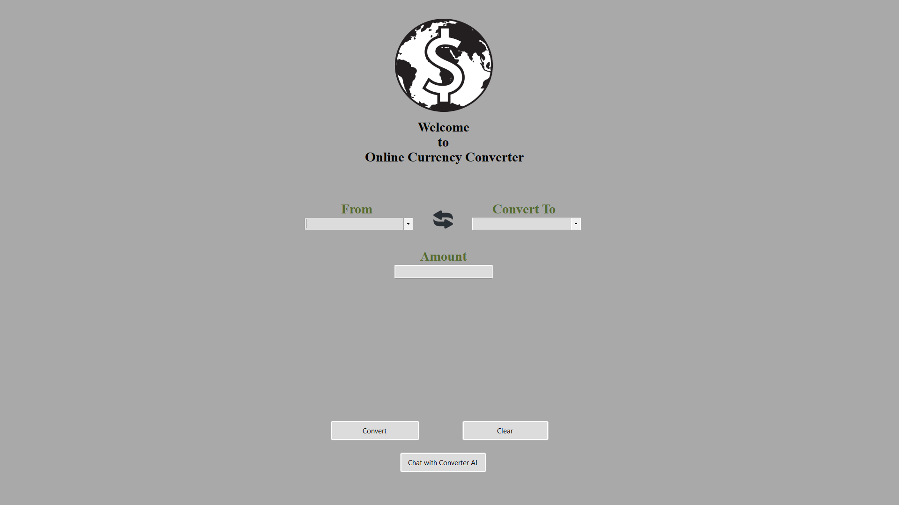

# AI Money Converter — VB.NET Desktop Application

[](LICENSE)
[](https://dotnet.microsoft.com/download)
[](https://openai.com/)

A high-performance, industry-grade desktop application for real-time currency conversion, featuring a deep integration with OpenAI's conversational models. This project demonstrates professional VB.NET architecture, secure API consumption, and modern desktop UI principles.

---

## 📌 Overview

The **AI Money Converter** is more than a standard utility; it is a sophisticated financial assistant. By combining robust Windows native performance with cutting-edge LLMs, it provides users with a dual-mode experience:

1.  **Direct Conversion**: Rapid, precise currency exchange rate calculations powered by GPT-3.5 Turbo.
2.  **Conversational Assistance**: A dedicated AI Chatbot interface (GPT-4 Turbo) that understands natural language queries for financial advice, trend analysis, and complex conversion scenarios.

Built using **VB.NET** on the **.NET 8.0** platform, the application leverages Windows Forms for a responsive, native user experience.

---

## ✨ Key Features

-   **Conversational Logic**: Interact with the converter using natural language (e.g., "How much is 500 Euros in USD today?").
-   **Dual-Model Architecture**: Optimized performance using GPT-3.5 for fast utility tasks and GPT-4 for complex assistant interactions.
-   **Real-time Exchange Rates**: Dynamic retrieval of financial data via secure REST API calls.
-   **Cybersecurity Best Practices**: Designed with security in mind—zero hardcoded secrets, environment-based configuration, and strict input validation.
-   **Native Windows UI**: Clean, intuitive interface designed for efficiency and desktop-native responsiveness.

---

## 🏗 Tech Stack

-   **Language**: VB.NET (Visual Basic .NET)
-   **Framework**: .NET 8.0 Windows Forms
-   **AI Engine**: OpenAI API (GPT-4 Turbo & GPT-3.5 Turbo)
-   **JSON Processing**: `Newtonsoft.Json` for high-speed serialization.
-   **Networking**: Asynchronous `HttpClient` for non-blocking UI operations.

---

## 🖥 Screenshots

### Main Interface


### AI Chat Assistant


### Live Conversion & Chat


---

## ⚙️ Installation & Setup

### Prerequisites

-   [Visual Studio 2022](https://visualstudio.microsoft.com/) with .NET Desktop Development workload.
-   [.NET 8.0 SDK](https://dotnet.microsoft.com/download/dotnet/8.0).

### Step-by-Step Guide

1.  **Clone the Repository**:
    ```bash
    git clone https://github.com/ISMEG-ZAKARIA/AI-Money-Converter-vbnet.git
    ```

2.  **Open the Solution**:
    Launch `MoneyConverter.sln` in Visual Studio.

3.  **Configure Environment Variables**:
    -   Locate the `.env.example` file in the root directory.
    -   Create a new file named `.env` in the same directory.
    -   Copy the contents of `.env.example` into `.env` and replace the placeholders with your actual API keys.
    -   *Note: The application is configured to read these keys at runtime. Never hardcode keys in the source files.*

4.  **Restore & Build**:
    -   Right-click the solution and select **Restore NuGet Packages**.
    -   Press `F5` or click **Start** to run the application.

---

## 🔑 Configuration

The application uses an environment-based configuration approach for maximum security. Ensure your `.env` file follows this structure:

```env
AI_API_KEY=YOUR_OPENAI_API_KEY_HERE
CURRENCY_API_KEY=YOUR_CURRENCY_API_KEY_HERE
```

---

## 🚀 Usage

1.  **Currency Mode**: Select "Base" and "Target" currencies, enter an amount, and click **Convert**.
2.  **AI Mode**: Click the **Assistance** button to launch the Chatbot. Ask questions like:
    *   "What are the current trends for USD vs EUR?"
    *   "Can you help me convert 1000 JPY to CAD?"
    *   "What factors are affecting exchange rates right now?"

---

## 🔒 Security Notice

As a project maintained with a focus on cybersecurity, security is paramount:
-   **No Secrets Committed**: All API keys have been sanitized from the source code.
-   **Protected Files**: Build artifacts, local user settings, and sensitive configs are strictly ignored via `.gitignore`.
-   **User Responsibility**: Users are responsible for managing their own API credentials securely.

---

## 📜 License

This project is licensed under the **MIT License**. See the [LICENSE](LICENSE) file for full details.